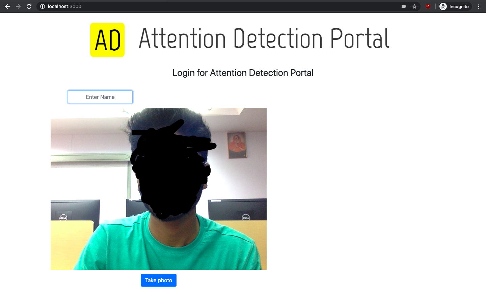

# Inertia_ByteCamp_2020
Repository for ByteCamp 2020 by Team Inertia.

# Problem Statement

> ## Attention Detection Portal in Online Lectures

# Table of Contents

* [Description](https://github.com/jsndc99/Inertia_ByteCamp_2020#description)
* [Dependencies](https://github.com/jsndc99/Inertia_ByteCamp_2020#dependencies)
* [Installation](https://github.com/jsndc99/Inertia_ByteCamp_2020#installation)
  * [Prerequisites](https://github.com/jsndc99/Inertia_ByteCamp_2020#prerequisites)
  * [Instructions](https://github.com/jsndc99/Inertia_ByteCamp_2020#instructions)
* [Usage](https://github.com/jsndc99/Inertia_ByteCamp_2020#usage)
* [Contributors](https://github.com/jsndc99/Inertia_ByteCamp_2020#contributors)
* [License](https://github.com/jsndc99/Inertia_ByteCamp_2020#license)

# Description

The project aims to quantify the attention paid by a user to online lectures and provide analysis of the same attention data. It uses the user's webcam to analyse the user's emotions, gaze and position of the hands to determine the attention. 

Our main aim while developing the project was to ensure **user privacy was not compromised.** Some steps we have taken to guarantee the same are:
* Webcam video feed doesn't leave the user's device. User data is kept secure. The webcam video feed isn't saved on the device or on any server. Only the attention metrics (no personal data) is sent to the server.
* The sign up and login processes do not use the user's face. Instead only the face features are used, which ensures privacy is protected.
* The database doesn't store any personal information of the users.

The attention values are plotted in real time for the instructor to analyse.
 
# Dependencies

* [Node.js](https://nodejs.org/en/)
* [npm](https://www.npmjs.com/)
* [Tensorflow.js](https://www.tensorflow.org/js/)
* [face-api](https://github.com/justadudewhohacks/face-api.js/)
* [Express](https://expressjs.com/)
* [Handlebars](https://handlebarsjs.com/)
* [PostgreSQL](https://www.postgresql.org/)
* [Python3](https://www.python.org/)
* [Flask](https://palletsprojects.com/p/flask/)
* [face_recognition](https://github.com/ageitgey/face_recognition)

# Installation

### Prerequisites

Install Node.js and npm using the link above. Follow instructions on their respecive websites. Npm is included with Node.js

Install PostgreSQL with the link above, following instructions on their respecive websites.

Install Python3 from the link provided above.

Install face_recognition module following the instructions provided above.

### Instructions

Clone the repository
```bash
git clone https://github.com/jsndc99/Inertia_ByteCamp_2020.git
```
Install all the dependencies
```bash 
npm install
```
Install Flask with pip
```python
pip install -U Flask
```

# Usage

Run the project
```bash
node server.js
```
Open a web browser and go to
```bash
http://localhost:3000
```

### Login Screen


### Video View Screen


# Contributors

* Jason D'Costa [@jsndc99](https://github.com/jsndc99)
* Elvis Dsouza [@ejson03](https://github.com/ejson03)
* Princeton Baretto [@princebaretto99](https://github.com/princebaretto99)

# License

[](https://opensource.org/licenses/MIT)

[MIT License Link](https://github.com/jsndc99/Inertia_ByteCamp_2020/blob/master/LICENSE)